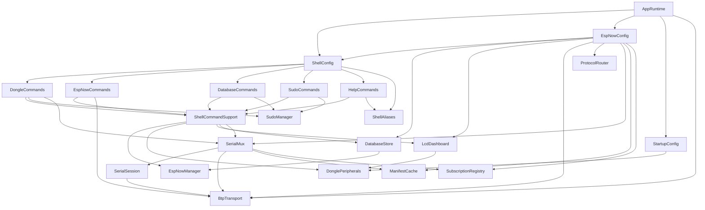

# Bally_dongle - T-Dongle S3 Firmware

Firmware para ESP32-S3 (LILYGO T-Dongle-S3) que transforma o dongle em um terminal
embarcado de operação/diagnóstico para uma malha de robôs via ESP-NOW:

- shell interativo via Serial USB, com histórico, edição in-line e autocompletar
- comunicação ESP-NOW (peers, envio unicast/broadcast, heartbeat de link, **execução remota de comando**)
- persistência SQLite em cartão SD (SD_MMC)
- saída em Serial + dashboard visual em grade no LCD ST7735
- controle de perifériros locais (LED RGB, LCD, SD, RTC)
- permissão em camadas estilo `sudo`, por identidade (serial ou peer ESP-NOW)

Consulte também [CONTRIBUTING.md](CONTRIBUTING.md) para o padrão de código e o processo
para alterar/estender o firmware.

## 1. Stack

- Framework Arduino via PlatformIO
- ESP32-S3 (`esp32-s3-devkitc-1`), C++17
- [TinyShell](https://github.com/AlisonTristao/TinyShell) — dispatch de módulos/comandos
- [BTP](https://github.com/AlisonTristao/BTP) (`lib_deps` fixado em `v2.9.0`) — codec/fragmentação
  do Binary Telemetry Protocol (fio v2, `version == 0x02`), compartilhado com `Bally_OS`/`TraceView`
- SQLite (`Sqlite3Esp32`) sobre SD_MMC
- Adafruit GFX + ST7735 (LCD 160x80)

## 2. Hardware alvo: T-Dongle-S3

Todo o mapeamento de pinos fica centralizado em [include/config.h](include/config.h)
(`namespace BoardConfig`):

| Periférico | Pinos |
|---|---|
| LED RGB onboard (DI/CI) | GPIO40 / GPIO39 |
| LCD ST7735 (SPI bit-banged) | CS=4, SDA(MOSI)=3, SCL(SCLK)=5, DC=2, RST=1, BL=38 |
| SD_MMC | D0=14, D1=17, D2=18, D3=21, CLK=12, CMD=16 |
| Botão BOOT | GPIO0 |
| USB nativo | D-=19, D+=20 |

Observações de hardware já tratadas no código:
- calibração de offset do painel ST7735 (`TFT_COL_START=26`, `TFT_ROW_START=1`)
- correção de cor (bit-invert + swap R/B) aplicada em `ShellCommandSupport::lcdColorForLine`
- polaridade de backlight configurável em runtime (`dongle -lcd_bl_inv`)
- "PIN_TFT_SDA"/"PIN_TFT_SCL" são os nomes dos sinais MOSI/SCLK do SPI bit-banged do LCD —
  **não há I2C real neste projeto** (sem `Wire.h`, sem periférico I2C em uso)

A senha usada pelo `sudo` do shell (ver seção 7) também mora em `config.h`
(`BoardConfig::SUDO_PASSWORD`) — troque antes de gravar em um dongle real.

## 3. Arquitetura

```text
Aplicação
  src/main.cpp            -> so chama AppRuntime::begin()/tick()
  AppRuntime               -> dono de todos os objetos runtime, setup, loop, tasks FreeRTOS

Orquestração do shell
  ShellConfig              -> bind do contexto, registro de módulos, runLine() (chaining, alias,
                               dedup de histórico, persistência)
  ShellCommandSupport       -> Context compartilhado (shell/espNow/peripherals/lcd/database/io),
                               printLine/failWithCode/warnWithCode, parsing utilitário
  ShellAliases              -> tabela de atalhos ("es" = "espnow -send_to")

Módulos de comando (um por "modulo" do TinyShell)
  HelpCommands   (help)     DongleCommands (dongle)   EspNowCommands (espnow)
  DatabaseCommands (database)                          SudoCommands (sudo)

Serviços/domínio
  EspNowManager   -> registry de peers e envio/recepção de bytes crus (sem saber o que é BTP)
  BtpTransport    -> identidade BTP (source_id/boot_id), sequência, envio fragmentado,
                     envelope COMMAND_REQUEST/COMMAND_RESULT (namespace btp_command)
  ProtocolRouter  -> wrapper fino sobre btp::Receiver (BTP 2.8.0): decode BTP + CRC +
                     reassembly + sweep de timeout; adiciona mac[6] + arrivalMs do chamador;
                     puro C++, sem Arduino, testável em env:native
  SerialSession   -> wrapper sobre btp::Session (BTP 2.9.0): ciclo de vida
                     Console/AwaitingHello/Protocolled + watchdog de inatividade + HELLO/
                     SESSION_CLOSE. Local: roteamento por object_id, texto ENTER/READY/CONSOLE,
                     STATUS v1/v2, classify. Puro C++, sem Arduino, testável em env:native
  ManifestCache   -> cache em memória de MANIFEST_DATA por source_id (tópico 16): guarda os
                     registros de tópico/ação de cada robô verbatim (opacos, delimitados por
                     record_size), monta MANIFEST_DATA para o desktop (alvo único ou
                     enumeração target=0, incluindo a auto-descrição do dongle como
                     role=DONGLE) e mantém a revisão agregada do catálogo (HELLO do dongle);
                     puro C++, sem Arduino
  SubscriptionRegistry -> agregação de assinaturas por (source_id, topic_id) (tópico 17):
                     junta os pedidos de todos os clientes seriais num único SUBSCRIBE
                     upstream na taxa/lease união, decide quando reenviar (mudança de taxa
                     ou renovação de lease) e quando enviar UNSUBSCRIBE (último consumidor),
                     e contabiliza bytes/amostras descartadas por tópico para o STATUS v2;
                     puro C++, sem Arduino, testável em env:native
  DatabaseStore   -> schema SQLite, migrações, leituras/gravações
  DonglePeripherals -> LED, LCD (driver), SD
  LcdDashboard    -> dashboard em grade sobre DonglePeripherals
  SudoManager     -> elevação de permissão por identidade (RAM, reseta no boot)
  EspNowConfig    -> callbacks ESP-NOW, fila RX assíncrona, roteamento por MessageType,
                     filas priorizadas por tipo, heartbeat BTP, execução remota (COMMAND)
  SerialMux       -> único escritor da porta serial no modo protocolado: decode COBS
                     incremental, filas FreeRTOS priorizadas por classe, encode COBS + write

Plataforma
  ShellLineEditor (editor de linha, no pacote TinyShell) / ShellOutput (formatação) / StartupConfig (boot)
  Arduino/ESP-IDF: WiFi, esp_now, FreeRTOS, SD_MMC, time
  BTP (lib externa via git, lib_deps fixado em v2.9.0): codec/fragmentação BTP (fio v2)
```

Grafo de dependências entre as libs (setas = "depende de"; auditado nesta revisão —
é um DAG, sem ciclos):



`BtpTransport` e `ProtocolRouter` entram como serviços de domínio (nível 5), lado a lado
com `EspNowManager`, mas **sem incluir `EspNowManager.h`**: como tanto `EspNowConfig`
(nível 5, mas acima na cadeia de RX) quanto `EspNowCommands` (nível 3) precisam enviar
frames BTP, uma dependência direta de `BtpTransport` em `EspNowManager` fecharia um ciclo
via `EspNowConfig --> ShellConfig --> EspNowCommands`. A saída: `BtpTransport::sendLogical`/
`sendLogicalWithStatus` recebem um callback de envio (`SendFn`/`SendWithStatusFn`) em vez do
`EspNowManager&` direto; cada chamador (`EspNowConfig.cpp`, `EspNowCommands.cpp`) define um
adaptador de uma linha que chama o `EspNowManager` real. `ProtocolRouter` não depende de
nada do projeto além de `BTP`. Como nenhum dos dois toca Arduino/FreeRTOS, ambos
compilam e têm testes rodando sob `env:native` (`test/test_protocol_router`).

`SerialMux` (tópico 13) é alcançado tanto por `EspNowConfig` (para retransmitir
TELEMETRY/LOG roteados do ESP-NOW para uma sessão serial protocolada) quanto por
`DongleCommands`/`ShellCommandSupport` (comando `dongle -btp_v1`, e para saber se a porta
ainda pertence ao console antes de escrever nela). Isso criaria o mesmo tipo de ciclo via
`ShellConfig` se `SerialMux` incluísse `ShellConfig.h` para chamar `runLine()` -- por isso
ele recebe um `RunShellLineFn` (mesmo padrão de callback de `BtpTransport::SendFn`) em vez
de incluir o módulo de shell direto; `AppRuntime::begin()` é quem liga os dois com uma
lambda sem captura. `SerialSession` (a lógica pura de handshake/estado da sessão, sem
Arduino) só depende de `BtpTransport` (reaproveita `btp_command::parse_request`/
`copy_shell_command`/`build_result` para o `COMMAND_REQUEST`/`COMMAND_RESULT` da sessão
serial, o mesmo parser usado no caminho ESP-NOW) e roda sob `env:native`
(`test/test_serial_session`), igual a `ProtocolRouter`/`BtpTransport`.

Ver [CONTRIBUTING.md § Arquitetura e camadas](CONTRIBUTING.md#arquitetura-e-camadas) para
a regra de quando um módulo novo deve entrar em `Context` ou pode ser incluído direto.

## 4. Fluxo de execução

`src/main.cpp` só chama `AppRuntime::begin()` (setup) e `AppRuntime::tick()` (loop).

### `AppRuntime::begin()`

1. `BoardConfig::initBoardPins(false)` — pinos em estado seguro (LCD apagado)
2. `Serial.setRxBufferSize(1024)` (margem para as linhas `BTP/1 ENTER` que o
   host empilha durante o boot, o default da CDC é 256 B) e `Serial.begin()`
   na baudrate de `platformio.ini` (`BAUDRATE`, cosmético na CDC nativa)
3. inicializa LED/LCD e anuncia o boot (`StartupConfig::announceBoot`) — não aguarda mais um
   monitor serial conectar (esse gate dependia de `Serial` refletir DTR asserted pelo host, o
   que só terminais interativos fazem ao abrir a porta; um cliente automático como o TraceView
   nunca assertava DTR, então o boot travava aqui indefinidamente); sem prompt bloqueante de
   "pressione ENTER" nem de data/hora: qualquer cliente chega ao shell interativo/negociação BTP
   em tempo finito sem precisar digitar nada nem abrir a porta de um jeito específico
4. inicia SD, imprime MAC Wi-Fi
5. deriva a identidade BTP deste boot (`BtpTransport::configureIdentity`) e chama
   `SerialMux::begin(...)`, ligando-o ao `ShellConfig::runLine` via callback
6. conecta callbacks ESP-NOW e habilita a fila RX assíncrona (`EspNowConfig`);
   se essa alocação falhar (heap), `onDataRecv` passa a **descartar** datagramas
   de rádio — nunca a processá-los inline (estouraria a stack da task Wi-Fi) —
   e o boot avisa em alto e bom som
7. `espNowManager_.begin(...)`
8. sobe as tasks FreeRTOS (RX worker, heartbeat worker)
9. `ShellConfig::bind(...)` + `ShellConfig::registerDefaultModules()`

O **SQLite não abre no `begin()`** (tópico 35 C.3): seu bootstrap tem um pico
transiente de ~30-40 KB e, no meio das alocações de `SerialMux`/ESP-NOW/Wi-Fi,
era o maior risco de OOM do caminho crítico. `AppRuntime::maybeInitDatabase()`
(chamado no `tick()`) abre o banco ~400 ms depois do boot, com folga de heap,
fora de um handshake BTP em andamento; ao abrir faz `logBootEvent`, carrega os
peers persistidos e restaura o histórico do shell. Até lá, todo método do
`DatabaseStore` falha fechado (`"nao inicializado"`) e um robô conhecido se
re-registra no primeiro frame de rádio.

### `AppRuntime::tick()` (chamado a cada `loop()`)

1. `maybeInitDatabase()` — abre o SQLite fora do caminho de boot (no-op depois
   de aberto); processa avisos assíncronos e saída ESP-NOW pendente
2. `lcdDashboard_.tick()` — redesenha tiles que mudaram (throttled internamente)
3. lê input da serial e roda o comando (`ShellConfig::runLine`) -- só quando `SerialMux`
   ainda não é dono da porta (ver seção 7bis)
4. `SerialMux::tick(millis())` — no-op rápido em modo console; decodifica/despacha bytes
   recebidos, checa o watchdog da sessão e drena as filas de saída priorizadas quando uma
   sessão BTP v1 está negociando/protocolada
5. `delay(1)` cooperativo

### Tasks FreeRTOS (fora do loop principal)

| Task | Função |
|---|---|
| `espnow_rx` | drena a fila RX e processa cada mensagem (`EspNowConfig::processRxMessage`) |
| `espnow_heartbeat` | a cada `HEARTBEAT_INTERVAL_MS`, faz ping no último peer que mandou dado real |

## 5. Shell (TinyShell)

Sintaxe: `<modulo> -<comando> [args]`. Comandos podem ser encadeados com `;`
(`dongle -ping; dongle -clock`), cada um logado separadamente. Aliases (tabela em
`ShellAliases`) substituem a primeira palavra digitada: `es 1, "dongle -ping"` vira
`espnow -send_to 1, "dongle -ping"`.

### 5.1 `help`

| Comando | Descrição |
|---|---|
| `help -h` | lista módulos |
| `help -l <modulo>` | lista comandos de um módulo |
| `help -e` | exemplos e dicas rápidas |

### 5.2 `dongle` — comandos locais

| Comando | Sintaxe | Descrição |
|---|---|---|
| `ping` | `dongle -ping` | teste local (`pong`) |
| `clock` | `dongle -clock` | data/hora do RTC local |
| `set_clock` | `dongle -set_clock "YYYY-MM-DD HH:MM:SS"` | ajusta RTC |
| `run` | `dongle -run "<comando>"` | executa outro comando localmente (bypassa `runLine`) |
| `led` / `led_off` | `dongle -led r, g, b` | LED RGB (0-255) / desliga |
| `lcd` / `lcd_clear` | `dongle -lcd "texto"` | escreve/limpa banner do LCD |
| `lcd_rot` / `lcd_rot_get` | `dongle -lcd_rot 0..3` | rotação do painel |
| `lcd_bl` / `lcd_bl_inv` | `dongle -lcd_bl 0\|1` | backlight e polaridade |
| `lcd_reinit` | `dongle -lcd_reinit` | reinicializa driver do LCD |
| `sd_init` / `sd_status` | | reinicia SD / mostra status |
| `sd_ls` / `sd_cat` | `dongle -sd_ls <path>` | lista dir / imprime arquivo texto (cap. 4KB) |
| `sd_write` / `sd_append` | `dongle -sd_write <arquivo>, <texto>` | grava/acrescenta em arquivo |
| `sd_rm` / `sd_mkdir` | `dongle -sd_rm <arquivo>` | remove arquivo / cria diretório |
| `sd_wipe` | `dongle -sd_wipe` | apaga TUDO do SD e recria o banco — **requer `sudo -login`** |
| `run_script` | `dongle -run_script <arquivo>` | roda um comando por linha de um arquivo no SD |
| `history` | `dongle -history 20` | reimprime comandos recentes do histórico persistido |
| `info` | `dongle -info` | chip/heap/flash/uptime/MAC |
| `reboot` | `dongle -reboot` | reinicia o ESP32 |
| `btp_v1` | `dongle -btp_v1` | negocia uma sessão BTP v1 protocolada nesta mesma porta (ver seção 7bis) |

### 5.2bis `hub` — vínculos de relay e chave do enlace (tópicos 28 e 30)

| Comando | Sintaxe | Descrição |
|---|---|---|
| `bind` | `hub -bind 1A2B3C4D, 33445566` | aponta um filho do console (primeiro id) para um robô (segundo id) |
| `unbind` | `hub -unbind 1A2B3C4D` | remove o vínculo daquele filho |
| `set_key_l` | `hub -set_key_l <senha>` | deriva a chave do canal C (dongle↔robô) da senha e grava em NVS |
| `key_status` | `hub -key_status` | mostra se há chave carregada, sem nunca imprimir a chave |

Registrado em `DongleCommands` mas em módulo próprio, porque o assunto é o hub e não os
periféricos desta placa. Os dois argumentos de `bind`/`unbind` são `source_id` BTP em
hexadecimal (a forma em que eles aparecem em log, LCD e `hub.peers`); `0x` é aceito e
opcional. A tabela tem 8 entradas, vive só em RAM e some no boot.

**Por que ela precisa existir:** o header do BTP não tem campo de destino, e TERMINAL não
tem nem `target_source_id` no payload — então, no sentido descendente (console → robô), o
dongle não tem como deduzir o destino de um frame. Ele precisa ser informado. É o exato
contrário do `hub.peers`: a descoberta desce como telemetria, o vínculo sobe como decisão
de operador. Um filho sem vínculo continua falando com o próprio dongle (terminal e
comandos locais), que é o comportamento anterior ao tópico.

**Chave do canal C (tópico 30):** desde que o rádio passou a ser selado, todo tráfego
dongle↔robô (heartbeat, presença, `COMMAND_REQUEST`/`COMMAND_RESULT`) exige a chave L
carregada — sem ela, `BtpTransport::sendLogical`/`encodeSingleFrame` simplesmente não
enviam nada (fecha fechado, sem fallback em texto claro) e um frame recebido que não abre
sob essa chave é descartado e contado (`espnow -stats`, campo `auth=`). `hub -set_key_l`
deriva a mesma chave que `bally_OS/scripts/provision_key.py --password-l` produziria da
mesma senha (PBKDF2-HMAC-SHA256, salt e iterações fixos — ver `lib/DongleKeyStore`), grava
em NVS para sobreviver a um reboot, e imprime só `verify_l` (uma tag pública de 8 octetos,
nunca a chave) para o operador confirmar na bancada que dongle e robô combinaram a mesma
senha. Este dongle nunca deriva ou guarda a chave E (canal B, TraceView↔robô) — só
administra o enlace, não lê o conteúdo que passa por ele.

### 5.3 `espnow` — peers e mensagens

| Comando | Sintaxe | Descrição |
|---|---|---|
| `list` | `espnow -list` | lista peers cadastrados, com indicação de `boot_id` conhecido/desconhecido |
| `add` / `remove` / `remove_mac` / `update` | `espnow -add "MAC", "nome", "desc"` | gestão de peers |
| `send_to` | `espnow -send_to 1, "dongle -clock"` | envia COMMAND_REQUEST pro peer de índice 1 |
| `send_all` | `espnow -send_all "<comando>"` | envia COMMAND_REQUEST pra cada peer com `boot_id` conhecido |
| `stats` | `espnow -stats` | contadores acumulados dos dois hops (rádio e USB), para medir vazão |

`stats` imprime contadores **cumulativos desde o boot**, não taxas: rode duas vezes e
divida a diferença pelo intervalo. Ele existe porque o `EspNowConfig` só contava
*descartes* — nada contava o que passou, então não havia como distinguir um rádio saturado
de um enlace USB saturado. O bloco `[espnow]` cobre o hop robô → dongle (datagramas
recebidos, fragmentos, mensagens roteadas por tipo, descartes por motivo, e desde o tópico
30 o campo `auth=` — um frame do canal C que não abriu sob a chave L, contado à parte
porque não é decode/CRC/fila cheia, é autenticação recusada) e o bloco `[usb]` cobre o hop
dongle → desktop (`frames_tx` e descartes **por classe de fila**, o que o STATUS não
separa). Fila de telemetria transbordando indica enlace saturado; fila de sessão
transbordando indica `loop()` travado — consertos opostos.

`send_to`/`send_all` enviam um frame BTP `COMMAND`/`COMMAND_REQUEST` (ação "shell") — isso faz
o **peer receptor executar o comando remotamente** e responder com um `COMMAND_RESULT`,
exibido como `[cmd_result] ...` (ver seção 7). Diferença importante em relação ao antigo
`CMDO`: um `COMMAND_REQUEST` precisa do `boot_id` atual do peer, que só é conhecido depois
de já termos recebido alguma mensagem dele (sem handshake HELLO ainda, tópico 16) — por
isso o alias de broadcast `000` foi removido e `send_to`/`send_all` falham com
`PEER_BOOT_UNKNOWN` para um peer do qual nunca recebemos nada, e com `LINK_KEY_NOT_CONFIGURED`
(tópico 30) se a chave L ainda não foi carregada com `hub -set_key_l`.

### 5.4 `database` — SQLite no SD

| Comando | Sintaxe | Descrição |
|---|---|---|
| `init` / `status` / `tables` | | abre banco / status geral / lista tabelas |
| `read` | `database -read peers, 20` | leitura simples com limite |
| `logs` | `database -logs 20` | histórico de comandos + saída |
| `espnow_history` | `database -espnow_history 30` | histórico TX/RX com status |
| `backup` | `database -backup` | snapshot do banco em `/database/backups` |
| `count` | `database -count <tabela>` | conta linhas |
| `delete` | `database -delete <tabela>, <condição SQL>` | remove linhas (condição obrigatória) |
| `vacuum` | `database -vacuum` | compacta o arquivo do banco |
| `export` | `database -export <tabela>` | dump da tabela em CSV (`/database/exports/`) |
| `exec` / `exec_nolog` | `database -exec "SELECT ..."` | SQL livre (com/sem log em `command_log`) |
| `drop` | `database -drop <tabela>` | remove tabela — **requer `sudo -login`** |
| `rebuild` | `database -rebuild` | recria banco do zero via bootstrap — **requer `sudo -login`** |
| `clear_logs` | `database -clear_logs` | apaga `command_log`/saídas/histórico ESP-NOW — **requer `sudo -login`** |

### 5.5 `sudo` — permissão elevada

| Comando | Descrição |
|---|---|
| `sudo -login <senha>` | eleva o usuário atual (quem digitou, local ou remoto) |
| `sudo -logout` | revoga a elevação do usuário atual |
| `sudo -status` | mostra se o usuário atual está elevado, e quantos ao todo |

Ver seção 7 para o modelo completo de identidade/permissão.

## 6. Banco de dados (SQLite)

- diretório: `/database`; bootstrap: `/database/bootstrap.sql`; arquivo: `/database/dongle.db`
  (caminho SQLite: `/sdcard/database/dongle.db`)
- backups em `/database/backups/`, exports CSV em `/database/exports/`

`DatabaseStore::begin()`: garante `/database`, cria `bootstrap.sql` se ausente, abre o banco,
aplica bootstrap + migrações idempotentes, garante o peer virtual `000` (broadcast,
`FF:FF:FF:FF:FF:FF`) e carrega peers reais para o `EspNowManager`.

Tabelas:

| Tabela | Campos principais |
|---|---|
| `peers` | `id`, `mac` (UNIQUE), `name`, `description`, `created_at`, `updated_at` |
| `command_log` | `id`, `command`, `source` (`serial`/`espnow`), `created_at` |
| `command_log_output` | `id`, `log_id` → `command_log.id`, `output`, `created_at` |
| `espnow_outgoing_log` | `id`, `peer_id` → `peers.id`, `mac`, `payload`, `payload_type`, `delivered`, `sent_at` (`payload_type` é o `btp::MessageType` numérico; `payload` é um preview textual, não o envelope BTP) |
| `boot_events` | `id`, `reason`, `boot_at` |
| `kv_store` | `key`, `value`, `updated_at` |

Cada comando rodado via `ShellConfig::runLine()` pode virar uma linha em `command_log` +
`command_log_output` — exceto: comandos idênticos ao anterior em sequência (dedup, ver
`g_lastCommandLine` em `ShellConfig.cpp`) e `database -exec_nolog`.

## 7. ESP-NOW: BTP, peers, heartbeat, execução remota e permissão

### 7.1 Envelope BTP (fio v2) (`BTP/include/btp/codec.hpp`)

Todo datagrama trocado com um peer é um frame BTP de fio v2 (`version == 0x02`
no header; fonte canônica no repositório
[BTP](https://github.com/AlisonTristao/BTP), integrada aqui via
`lib_deps = https://github.com/AlisonTristao/BTP.git#v2.9.0`):
`btp::Header` (`type`, `flags`, `source_id`, `boot_id`, `sequence`, `timestamp_us`,
`object_id`, `fragment_index`, `fragment_count`) + payload + CRC-32. `EspNowManager` só
transporta bytes crus; `ProtocolRouter` (via `btp::Receiver`) decodifica, valida o CRC e
faz reassembly antes de rotear por `MessageType` (`Telemetry`/`Log`/`Command`/
`Terminal`/`Control`) para uma fila própria em `EspNowConfig` (uma por tipo, com contador de
drop). `source_id`/`boot_id`/`sequence`/`timestamp_us` da origem chegam intactos ao próximo
estágio; o horário de chegada é só metadado local (`RoutedMessage::arrivalMs`), nunca
sobrescreve `timestamp_us`. `TELEMETRY` é passada adiante como bytes crus (sem `String`,
`snprintf` ou qualquer formatação) — ainda não tem consumidor nesta versão (isso é dos
tópicos 13/14, TraceView); `TERMINAL`/`CONTROL` (HELLO/MANIFEST/STATUS) também não têm
consumidor ainda (tópicos 16/19) e são apenas drenados/descartados, liberando a fila.

`HELLO`/`MANIFEST` **não são `MessageType` novos**: no wire format já congelado eles são
`object_id`s dentro de `CONTROL` (`0x0001`=`HELLO`, `0x0004`=`MANIFEST_DATA`, ver
`BTP/docs/commands.md` seção 1, subseção `object_id` namespaces) — não havia motivo pra inventar
valores de enum novos no codec canônico só pra este tópico.

### 7.2 Identidade deste dongle (`BtpTransport`)

No boot, `AppRuntime::begin()` chama `BtpTransport::configureIdentity(source_id, boot_id)`:
`source_id` é derivado do próprio MAC Wi-Fi (mesma fórmula usada em `Bally_OS`, sem
handshake); `boot_id` é um valor aleatório não nulo por boot (`esp_random()`) — não há
HELLO/MANIFEST ainda (tópico 16) pra anunciar/persistir isso, e nada aqui depende de
sobreviver a um reboot.

Como o dongle não tem como descobrir o `boot_id` de um peer sem HELLO, `BtpTransport`
mantém uma tabela pequena (`rememberPeer`/`lookupPeer`) do último `(source_id, boot_id)`
visto por MAC, atualizada a cada mensagem BTP válida recebida. `espnow -send_to`/`-send_all`
só conseguem endereçar um `COMMAND_REQUEST` pra um peer que já apareceu nessa tabela.

### 7.3 Heartbeat (indicador LINK no LCD)

A cada `HEARTBEAT_INTERVAL_MS` (`EspNowConfig.h`), a task `espnow_heartbeat` manda um frame
BTP `CONTROL`/`STATUS` (`object_id=0x0009`, payload vazio — "publicação espontânea, sem
resposta" por definição no wire format) para o **último peer de onde chegou dado real** (não
é broadcast pra todos, é sempre o mais recente). O resultado (ACK de entrega, não o payload)
atualiza o tile `LINK` do dashboard.

Desde o tópico 30 este frame é selado com a chave L (canal C, `RadioSeal::seal`) como
qualquer outro que o dongle originar no rádio; sem chave carregada (`hub -set_key_l`) o
selamento falha e nada é enviado — fecha fechado, nunca em texto claro. O ACK de entrega é
só uma confirmação de camada de rádio (o heartbeat não tem resposta), não prova por si só
que o peer tem a mesma chave; a prova de fato vem de `hub.peers.online` (tópico 27,
`DonglePublisher::PeerRecord`), que passou a exigir também que o último frame consumido
daquele peer tenha aberto sob L (`EspNowConfig.cpp`'s `RadioSeal::open`), não só o ACK do
heartbeat.

### 7.4 Execução remota de comando (`COMMAND`/`COMMAND_REQUEST`)

`espnow -send_to`/`espnow -send_all` enviam um `COMMAND_REQUEST` (ação "shell",
`action_id=1`/`action_version=1`, mesma convenção usada em `Bally_OS`). Ao receber:

1. `EspNowConfig` só segue adiante se o MAC de origem **já está cadastrado no registry de
   peers** — MAC desconhecido é ignorado (a mensagem ainda é roteada/loga normalmente, só
   não dispara execução).
2. O envelope é validado (`BtpTransport::btp_command::parse_request`): `target_source_id`/
   `target_boot_id` precisam bater com a identidade deste boot; addressed-to-outro-peer é
   silenciosamente ignorado, envelope malformado responde `REJECTED`.
3. O texto do comando roda via `ShellConfig::runLine(texto, "espnow", &fullOutput, userId)`,
   onde `userId = "espnow:<MAC>"` — **cada peer é uma identidade própria** para fins de sudo.
4. A saída completa volta ao mesmo MAC como `COMMAND_RESULT` (`SUCCESS`/mensagem = saída do
   shell) — nunca como um novo `COMMAND_REQUEST`, então não há risco de loop resposta-gera-
   resposta por construção do protocolo (tipos diferentes de objeto).
5. Fragmentação agora é transparente (via `ProtocolRouter`/`btp::Receiver`): um comando
   remoto pode ocupar vários pacotes ESP-NOW (limite prático ~512 bytes de texto).

Exemplo: um robô manda `dongle -clock` via `send_to` para buscar a hora; o dongle executa e
responde automaticamente com o horário, exibido aqui como `[cmd_result] ...`.

### 7.5 Permissão (`sudo`)

Modelo de "usuário" análogo ao `sudo` do Linux, implementado em `SudoManager`:

- cada identidade que fala com o shell é uma string livre: `"serial"` para o console
  USB/UART, `"espnow:<MAC>"` para cada peer registrado — extensível pra transportes futuros
  (ex.: `"mqtt:<client_id>"`) sem mudar o `SudoManager`.
- `sudo -login <senha>` eleva **a identidade que rodou o comando**, comparando com
  `BoardConfig::SUDO_PASSWORD` (constante compilada, ver `include/config.h`).
- a elevação vive só em RAM (`std::set` de identidades elevadas dentro de `SudoManager.cpp`)
  e **sempre reseta no boot** — não há persistência em SD/banco de propósito.
- comandos destrutivos (`dongle -sd_wipe`, `database -drop`, `database -rebuild`,
  `database -clear_logs`) checam `SudoManager::isElevated(currentUserId())` antes de agir.

**Modelo de confiança para execução remota (decisão deliberada, preservada na migração pra
BTP):** qualquer peer já cadastrado no registry pode disparar qualquer comando do shell via
`COMMAND`/`COMMAND_REQUEST`, sem restrição de conteúdo — inclusive `sudo -login`. A
identidade sudo continua vinculada ao **peer autorizado por MAC** (`espnow:<MAC>`), nunca ao
conteúdo do comando ou a algo do envelope BTP em si. Ou seja, a barreira real contra um peer
malicioso é (a) não deixar MACs não confiáveis virarem peers cadastrados, e (b) a senha do
`sudo` para os comandos destrutivos. Um peer cadastrado que souber a senha tem controle total
do dongle.

### 7.6 Sessão BTP v1 na serial USB (`SerialSession`/`SerialMux`, tópico 13)

A mesma porta USB do console humano também serve BTP v1 para um cliente automático (ex.:
TraceView), seguindo `BTP/docs/session-and-terminal.md`:

- **Entrada**: a porta começa em modo console (`ShellLineEditor`). Uma linha completa
  `BTP/1 ENTER <16 hex>\r\n` é reconhecida como controle reservado (não é um comando
  TinyShell) e responde `BTP/1 READY <hex minúsculo>\r\n`; a partir daí a sessão fica
  `AwaitingHello` aguardando um frame `HELLO` por até 2s. Alternativamente, um humano num
  terminal pode digitar `dongle -btp_v1` (PASSO 2) para o mesmo efeito, sem precisar montar a
  linha crua na mão.
- **Negociação**: `HELLO` é validado (`SerialSession::parseHello`) e os limites efetivos são
  o mínimo entre o que o cliente pediu e os limites locais deste dongle
  (`SerialSession::LocalLimits`); sucesso responde `HELLO_RESULT` e a sessão vira
  `Protocolled`. Sem versão em comum, responde `HELLO_RESULT`/`UNSUPPORTED` e volta direto pro
  console.
- **`SerialMux`** é o único escritor da porta nesse modo: decodifica bytes recebidos com
  `btp::SerialDecoder` (COBS incremental) e serializa a saída em quatro filas FreeRTOS
  priorizadas (`SerialSession::PriorityClass`) — sessão/`COMMAND_RESULT`, terminal, log/status,
  telemetria, nessa ordem — cada uma com profundidade e contador de descarte próprios.
  `ShellCommandSupport::printLine` e os pontos de log direto do `EspNowConfig`/`AppRuntime`
  passam a checar `SerialMux::isConsoleOwned()` antes de escrever na `Serial`, para nenhuma
  task nunca escrever a porta por fora do mux enquanto uma sessão está ativa.
- **Canais**: desde o tópico 28 o tráfego do rádio **sobe por padrão**. `EspNowConfig` lê só
  o envelope de cada datagrama e consulta `bally::dongle_consumes()`
  (`include/bally_channels.h`, a única cópia dessa lista); o que não está na lista vai para o
  cliente **verbatim, fragmento por fragmento**, via `SerialMux::relayUp` — sem remontar e sem
  recodificar (o `ProtocolRouter` saiu do caminho de relay). O que o dongle consome, e tudo
  enquanto a porta ainda é do console, segue o caminho antigo (`ProtocolRouter` +
  `forwardRelay`). No sentido descendente, um frame do cabo que não é endereçado ao dongle
  vai para o rádio pelo `SerialMux::relayDown`, resolvendo o destino pelo `HubRegistry`
  (seção 5.2bis) e por `BtpTransport::lookupPeerMacBySourceId`.

  Nos dois sentidos o relay **nunca reescreve `source_id`, `boot_id` nem `sequence`**: esses
  três campos *são* o nonce AEAD (`BTP/docs/encryption.md` seção 4), e todo o resto deste
  firmware re-origina mensagens via `sendLogical` — seguir esse padrão aqui quebraria um selo
  calculado em outro repositório. Refragmentar, ao contrário do que parece, seria seguro para
  o selo (o AAD é o header lógico canonicalizado, com `fragment_index`/`fragment_count`/
  `FRAGMENTED` deliberadamente fora dele); o dongle não refragmenta por vazão e retransmissão,
  não pelo selo. `test/test_hub_relay` fixa isso.

  `COMMAND_REQUEST`/`TERMINAL_IN` vindos do cliente e endereçados **ao dongle** continuam
  rodando via `ShellConfig::runLine` com identidade `"serial"` (mesmo perímetro de confiança
  do console físico) e respondendo `COMMAND_RESULT`/`TERMINAL_OUT`.
  `STATUS` (contadores de `frames_rx/tx`, CRC, decode, etc.) é publicado a cada 2s — desde o
  tópico 17 com `status_version=2` sempre que houver pelo menos um tópico rastreado (ver 7.7).
- **Saída**: `SESSION_CLOSE` do cliente ou o watchdog (`session_timeout_ms` negociado, sem
  frame BTP válido) fecham a sessão: o dongle descarta o que ainda não foi enviado nas filas,
  escreve exatamente `BTP/1 CONSOLE\r\n` e devolve a porta para `ShellLineEditor`.
- **Fora de escopo deste tópico** (ver RESULTADO em
  `BTP/topicos/13_dongle_serial_mux_sessao.txt`): fragmentação/reassembly de
  mensagens lógicas maiores que um frame serial (4096 octetos já é folgado para os payloads
  atuais). `MANIFEST` (tópico 16), `SUBSCRIBE`/`UNSUBSCRIBE` (tópico 17, ver 7.7) e o
  protocolo interativo completo de terminal (tópico 19) foram implementados depois, nos
  tópicos indicados.

### 7.7 Assinaturas e controle de taxa (`SubscriptionRegistry`, tópico 17)

O dongle é um agregador, não um repassador: ele nunca encaminha o `SUBSCRIBE` cru de um
cliente para o robô (`BTP/docs/commands.md` seção 4).

- **Agregação**: `SubscriptionRegistry` mantém uma linha por `(source_id, topic_id)` com o
  conjunto de sessões seriais interessadas (`clientId` = `source_id` do `HELLO` daquela
  sessão). O que vai ao robô é sempre **um** `SUBSCRIBE` por tópico, com a **união** dos
  pedidos vivos: a maior `requested_rate_millihz` e o maior `requested_lease_ms`.
- **Resposta ao cliente**: o `SUBSCRIBE_RESULT` é respondido de imediato pelo `SerialMux`, a
  partir do `max_rate_millihz` já cacheado pelo `ManifestCache` — a taxa efetiva devolvida
  nunca excede nem a pedida nem a máxima do schema, e o cliente não espera um round-trip
  ESP-NOW. A taxa que o **robô** de fato concedeu chega depois, no `SUBSCRIBE_RESULT` dele, e
  é publicada no `STATUS` v2 (`effective_rate_millihz`).
- **Quando o robô é reavisado**: tópico recém-ativado; taxa da união mudou (**inclusive para
  baixo**, quando o cliente mais rápido sai e outro permanece); ou o lease concedido passou da
  metade (renovação, varrida a cada `tick()`). Um pedido repetido que não muda a união não
  gera tráfego ESP-NOW nenhum.
- **`UNSUBSCRIBE` upstream** é enviado **somente** quando o último consumidor do tópico some —
  por `UNSUBSCRIBE` do cliente, por expiração de lease, ou por fim de sessão (fechamento
  explícito, `HELLO` rejeitado ou timeout do watchdog, que removem todas as assinaturas
  daquele cliente).
- **Contadores e `STATUS` v2**: `SerialMux::forwardRelay` só retransmite `TELEMETRY` de um
  tópico assinado e contabiliza, por `(source_id, topic_id)`, bytes de payload lógico
  encaminhados e amostras descartadas. Esses valores viram registros `topic_status` no
  `STATUS` com `status_version=2` (`commands.md` seção 5.1) — a desambiguação por `source_id` é obrigatória
  porque este dongle relata mais de uma fonte. O bloco v1 de 92 octetos continua idêntico e no
  mesmo offset. Nem o `timestamp_us` nem o schema da telemetria são tocados em nenhum ponto
  desse caminho.
- **Registro `topic_status` de 28 octetos**: a seção 5.1 do `BTP/docs/commands.md` declara
  "28 x T" e a lista de campos (`uint32 + uint16 + uint16 + uint32 + uint64 + uint64`) soma
  **28**, que é o que este firmware serializa. (Uma revisão antiga daquela seção dizia "24
  octetos" por um erro de aritmética no texto, com os tipos por campo já inequívocos; a spec
  foi corrigida desde então.) O valor está concentrado em
  `SerialSession::kTopicStatusRecordSize`, com `static_assert`, para realinhar em uma linha
  caso o layout mude.

## 8. LCD Dashboard (`LcdDashboard`)

Substitui o antigo terminal de rolagem (o texto já existe na serial e no banco). Layout
160x80, atualizado em `tick()` a cada loop mas com redesenho throttled
(`REFRESH_INTERVAL_MS`):

```text
[ banner de mensagem/relógio                     ]
[  LINK  |   RX   |   TX   ]
[      STATE (2x largura)  |   ERR   ]
```

- **LINK**: resultado do heartbeat (verde=entregue, vermelho=falhou)
- **RX** / **TX**: pulso a cada mensagem recebida/enviada (`PULSE_HOLD_MS`)
- **STATE**: último `state changed: OLD -> NEW` visto em uma mensagem RX (extraído por
  `tryExtractRobotState` em `EspNowConfig.cpp`)
- **ERR**: contador de pacotes ESP-NOW descartados/sobrescritos por fila cheia

## 9. Serial e UX

- `ShellLineEditor` (no pacote TinyShell, compartilhado com o terminal BTP e com
  o robô): edição de linha server-side (echo, setas, backspace, `ESC[A`/`ESC[B`,
  Tab, Ctrl+R), histórico restaurado do banco no boot. `feed()`/`poll()` em vez
  de `Stream`; o que ecoaria vai para um `std::string`.
- `ShellOutput`: prefixa linhas (`! ` erro, `> ` resposta comum)
- `ShellCommandSupport::printLine()` manda a mesma linha para: serial, buffer de
  persistência (`command_log_output`) e banner do LCD (com cor por heurística de texto)

> **A CDC nativa do ESP32-S3 (`ARDUINO_USB_MODE=0`) só TRANSMITE com DTR
> afirmado pelo host.** `tud_cdc_n_connected()` testa só o bit DTR, e
> `USBCDC::write()` retorna 0 — descartando todo byte — enquanto ele estiver
> baixo. RX funciona sem DTR. Um terminal que abre a porta sem afirmar DTR vê
> o serial **vazio** mesmo com o dongle rodando normal. `pio device monitor`,
> PuTTY e o Serial Monitor do Arduino afirmam; alguns apps web e minicom sem
> `-a` não. Qualquer cliente novo (script, ferramenta) tem que afirmar DTR —
> é por isso que o TraceView faz `setDataTerminalReady(true)` ao abrir
> (`SerialManager::open`). Ver tópico 35 F1.

## 10. Build, upload e monitor

Config principal: [platformio.ini](platformio.ini) — ambiente `tdongle-s3`,
`COM5 @ 921600`, C++17, USB CDC habilitado no boot.

```bash
platformio run -e tdongle-s3
platformio run -e tdongle-s3 -t upload
platformio run -e tdongle-s3 -t monitor
```

`scripts/pio_warnings.py` aplica `-Wno-discarded-qualifiers` na compilação C do
`Sqlite3Esp32` (upstream gera esse warning, não é nosso código).

`-DDIAG_BOOT` (em `build_flags`, **ligado por padrão** enquanto se valida o
boot na bancada): imprime `after_* free_heap=` a cada alocador do `begin()`,
`reg:* largest=` a cada módulo do shell, e segura 2 s no início para a CDC
re-enumerar. Comente essa linha para um build de campo — o boot fica quieto
(só `last_reset=`, que fica sempre ligado) e o handshake não paga os 2 s.
`-DDONGLE_USB_NO_AUTORESET` desliga o reboot-por-linha da USBCDC (nenhum toque
de 1200 bps nem sequência de DTR reinicia o firmware rodando) ao custo de
gravar só com o botão BOOT — só para build de campo/demo.

Há também um ambiente host-only, `env:native`, que roda `ProtocolRouter`/`BtpTransport`/
`SerialSession` contra os vetores canônicos de `BTP/test-vectors/v1` sem
precisar de hardware (mesmo padrão de `Bally_OS`, resolvido via `lib_deps`
em vez de diretório irmão). `test_serial_session` cobre o handshake HELLO/HELLO_RESULT, SESSION_CLOSE, o
round-trip COBS de um payload com `0x00`/CR/LF, recuperação após ruído/frame truncado e um
teste de estresse com TELEMETRY e TERMINAL_IN intercalados (tópico 13, PASSOS 6/12 e os
CRITERIOS DE ACEITE 1-3):

```bash
platformio test -e native
```

Esse comando também roda `scripts/check_user_text.py` (`extra_scripts` de `env:native`) antes
dos testes: audita `lib/**/*.cpp` procurando string de `printLine`/`failWithCode`/
`warnWithCode` esquecida em inglês (ou com acento) e string de `create_module`/`shell->add`
traduzida pro português por engano — ver CONTRIBUTING.md § 1.

## 11. Estrutura do repositório

```text
include/
  config.h              # pinos + BoardConfig::SUDO_PASSWORD
  error_codes.h         # AppError::Code (um range por subsistema)
  bally_channels.h      # tabela unica de canal/chave (topico 25/30), copia byte-identica em 3 repos
lib/
  AppRuntime/            # dono dos objetos runtime, setup/loop, tasks FreeRTOS
  ShellConfig/           # bind + registro de módulos + runLine()
  ShellCommandSupport/   # Context compartilhado + helpers de wrapper
  ShellAliases/          # tabela de atalhos de comando
  DongleCommands/ EspNowCommands/ DatabaseCommands/ SudoCommands/ HelpCommands/
  EspNowManager/          # registry de peers + envio/recepção de bytes crus (sem BTP)
  BtpTransport/           # identidade BTP, sequência, envio fragmentado+selado, COMMAND envelope
  DongleKeyStore/         # deriva/guarda a chave L (PBKDF2, puro C++, testável em env:native)
  RadioSeal/              # unico ponto que chama btp::aead -- seal/open do canal C (so Arduino)
  ProtocolRouter/         # decode BTP + CRC + reassembly compartilhado (puro C++)
  HubRegistry/            # tabela de vinculo filho-do-console -> robo (tópico 28)
  HubRelay/               # classifica ingresso do rádio e reenquadra sem reoriginar (tópico 28)
  DonglePublisher/        # manifesto e telemetria própria do dongle (hub.link/hub.usb/hub.peers)
  EspNowConfig/           # callbacks ESP-NOW, filas priorizadas por tipo, heartbeat, exec remota
  SerialSession/          # estado console/handshake BTP v1 da sessão serial (puro C++)
  SerialMux/              # unico escritor da serial no modo protocolado: COBS + filas FreeRTOS
  UsbHidMux/              # segundo interface USB (HID), spike de eco (tópico 20, sem BTP real)
  ManifestCache/          # cache/agregação de MANIFEST_DATA por source_id (puro C++)
  SubscriptionRegistry/   # agregação de assinaturas e contadores por tópico (puro C++)
  DatabaseStore/                 # schema SQLite e leituras/gravações
  DonglePeripherals/ LcdDashboard/  # LED/LCD/SD e dashboard em grade
  SudoManager/                   # elevação de permissão por identidade
  ShellOutput/                   # formatação de saída do terminal
  StartupConfig/                 # sequência de boot
  (o editor de linha é ShellLineEditor, no pacote TinyShell)
src/
  main.cpp
scripts/
  pio_warnings.py
  native_static.py      # so para env:native (evita runtime MinGW solto no PATH)
  check_user_text.py    # so para env:native (audita convencao pt-br/ingles, ver CONTRIBUTING.md #1)
test/
  test_tablelinker/      # demo antiga do TinyShell, hardware-only
  test_protocol_router/  # BTP vs. vetores canônicos + plumbing de selagem, roda em env:native
  test_serial_session/   # handshake/COBS/estresse da sessão serial, roda em env:native
  test_subscription_registry/  # agregação de assinaturas + STATUS v2, roda em env:native
  test_dongle_publisher/ # serialização hub.link/hub.usb/hub.peers + manifesto, roda em env:native
  test_hub_relay/        # ingresso/relay verbatim + vínculo (tópico 28), roda em env:native
  test_dongle_key_store/ # PBKDF2 vs. vetor de provision_key.py (tópico 29/30), roda em env:native
platformio.ini
CONTRIBUTING.md
```

## 12. Limitações conhecidas

- ESP-NOW em si roda sem criptografia de link própria (`encrypt=false`) — desde o tópico 30
  isso não deixa o canal C em claro: todo tráfego dongle↔robô é selado por cima com
  AES-128-GCM (chave L, ver seção 5.2bis). O canal B (TraceView↔robô) permanece cifra do
  robô ao TraceView, e nunca deste dongle — ele repassa sem conseguir ler.
- sem retry automático de envio após timeout de callback
- limite de peers em memória: `MAX_DEVICES = 16`
- payload reassemblado limitado a `ProtocolRouter::kMaxPayloadSize` (616 bytes desde o
  tópico 30 — os 600 de `BtpTransport::kMaxLogicalPayloadSize` mais os 16 octetos da tag
  AEAD do canal C; cobre um `COMMAND_REQUEST` de texto completo com folga) — mensagem maior
  que isso é rejeitada como `MessageTooLarge` antes de virar `RoutedMessage`
- `espnow -send_to`/`-send_all` só conseguem endereçar um peer do qual já recebemos alguma
  mensagem BTP (não há handshake HELLO ainda, tópico 16, pra descobrir `boot_id` de outra
  forma) — o antigo alias de broadcast `000` foi removido por isso
- RTC depende de ajuste manual via `dongle -set_clock` (sem RTC externo dedicado; não há mais
  prompt de data/hora no boot — ver seção 4)
- fila RX pode perder pacotes sob alta carga (contador de dropped exposto no tile `ERR`)
- `CONTROL` roteado do lado ESP-NOW tem consumidor para `MANIFEST_DATA` (tópico 16) e
  `SUBSCRIBE_RESULT` (tópico 17); `UNSUBSCRIBE_RESULT` e qualquer outro `object_id` (um
  `HELLO` perdido, um id reservado) continuam drenados e descartados, só contabilizados.
  `TELEMETRY`/`LOG` do ESP-NOW já têm consumidor real desde o tópico 13: são retransmitidos
  para uma sessão serial protocolada (`SerialMux::forwardRelay`); sem sessão ativa, o efeito
  observável continua sendo "drenado e descartado, só contabilizado" como antes
- a sessão serial (tópico 13) não reassembla mensagens lógicas fragmentadas em mais de um
  frame serial (limite prático de 700 bytes de payload por mensagem própria deste dongle,
  bem abaixo do teto de 4096 do wire format) — suficiente para HELLO/STATUS/COMMAND_RESULT/
  TERMINAL_OUT atuais, mas um manifesto grande (tópico 16) vai precisar dessa reassembly
- `TERMINAL_IN`/`TERMINAL_OUT` na sessão serial é uma linha de shell por mensagem (sem
  dedup de `COMMAND_REQUEST`, sem pty real) — o protocolo interativo completo é tópico 19
- assinaturas (tópico 17) são limitadas a `SubscriptionRegistry::kMaxTopics = 8` pares
  `(source_id, topic_id)` e `kMaxClientsPerTopic = 4` sessões por tópico; estouro responde
  `REJECTED`/`CAPACITY_EXHAUSTED` ao cliente, nunca descarta silenciosamente
- o `SUBSCRIBE` upstream só alcança um robô do qual já recebemos alguma mensagem BTP (mesma
  limitação de `espnow -send_to` acima); e se o robô nunca respondeu `SUBSCRIBE_RESULT`, o
  dongle não tem `subscription_id` para montar o `UNSUBSCRIBE` — nesse caso a assinatura do
  robô morre pelo lease dele, não por comando
- a taxa efetiva no `SUBSCRIBE_RESULT` respondido ao cliente é a do clamp local (schema
  cacheado); a taxa que o robô realmente concedeu só aparece no `topic_status` do `STATUS` v2
- `SerialSession::kTopicStatusRecordSize` vale 28, igual ao que a seção 5.1 do
  `BTP/docs/commands.md` declara hoje (uma revisão antiga daquela seção dizia "24 octetos", ver
  7.7); se o layout mudar, é essa constante que muda
- banco em arquivo local no SD (sujeito a falhas de cartão/contato)
- senha do `sudo` é uma constante compilada — trocar exige reflash; qualquer peer
  cadastrado que souber a senha tem controle total do dongle (ver seção 7.5)
- bug intermitente conhecido, não resolvido: o LCD ocasionalmente "apaga" a tela por um
  instante enquanto a serial continua atualizando normalmente; suspeita não confirmada é
  contenção entre o SPI bit-banged do LCD e a task de rádio WiFi/ESP-NOW

## 13. Dicas rápidas de uso

- primeiro comando sugerido: `help -e`
- verificar SD/banco: `dongle -sd_status` e `database -status`
- listar peers: `espnow -list`
- teste local: `dongle -ping`
- teste remoto (depois que o peer já tiver mandado algo, ver seção 7.2): `espnow -send_to 1, "dongle -ping"`
- elevar permissão antes de um comando destrutivo: `sudo -login <senha>`
- negociar uma sessão BTP v1 manualmente para testes: `dongle -btp_v1` (ver seção 7.6);
  `SESSION_CLOSE` do lado do cliente (ou silêncio por `session_timeout_ms`) devolve o console
