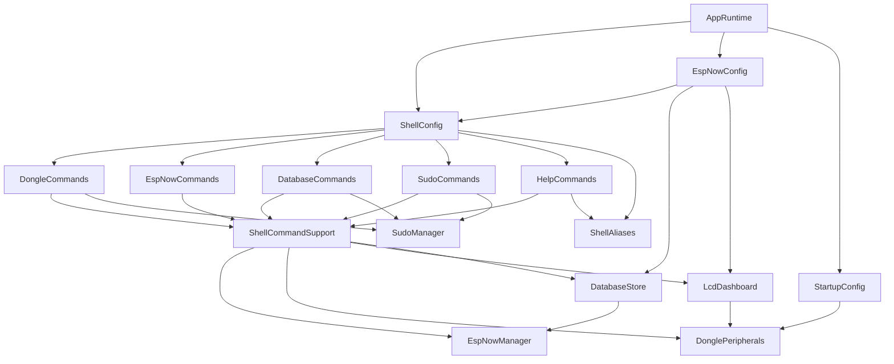

# T-Dongle S3 Firmware (t_dongle_develop)

Firmware para ESP32-S3 (LILYGO T-Dongle-S3) que transforma o dongle em um terminal
embarcado de operação/diagnóstico para uma malha de robôs via ESP-NOW:

- shell interativo via Serial USB, com histórico, edição in-line e autocompletar
- comunicação ESP-NOW (peers, envio unicast/broadcast, heartbeat de link, **execução remota de comando**)
- persistência SQLite em cartão SD (SD_MMC)
- saída em Serial + dashboard visual em grade no LCD ST7735
- controle de perifériros locais (LED RGB, LCD, SD, RTC)
- permissão em camadas estilo `sudo`, por identidade (serial ou peer ESP-NOW)

Consulte também [CONTRIBUTING.md](CONTRIBUTING.md) para o padrão de código e o processo
para alterar/estender o firmware.

## 1. Stack

- Framework Arduino via PlatformIO
- ESP32-S3 (`esp32-s3-devkitc-1`), C++17
- [TinyShell](https://github.com/AlisonTristao/TinyShell) — dispatch de módulos/comandos
- SQLite (`Sqlite3Esp32`) sobre SD_MMC
- Adafruit GFX + ST7735 (LCD 160x80)

## 2. Hardware alvo: T-Dongle-S3

Todo o mapeamento de pinos fica centralizado em [include/config.h](include/config.h)
(`namespace BoardConfig`):

| Periférico | Pinos |
|---|---|
| LED RGB onboard (DI/CI) | GPIO40 / GPIO39 |
| LCD ST7735 (SPI bit-banged) | CS=4, SDA(MOSI)=3, SCL(SCLK)=5, DC=2, RST=1, BL=38 |
| SD_MMC | D0=14, D1=17, D2=18, D3=21, CLK=12, CMD=16 |
| Botão BOOT | GPIO0 |
| USB nativo | D-=19, D+=20 |

Observações de hardware já tratadas no código:
- calibração de offset do painel ST7735 (`TFT_COL_START=26`, `TFT_ROW_START=1`)
- correção de cor (bit-invert + swap R/B) aplicada em `ShellCommandSupport::lcdColorForLine`
- polaridade de backlight configurável em runtime (`dongle -lcd_bl_inv`)
- "PIN_TFT_SDA"/"PIN_TFT_SCL" são os nomes dos sinais MOSI/SCLK do SPI bit-banged do LCD —
  **não há I2C real neste projeto** (sem `Wire.h`, sem periférico I2C em uso)

A senha usada pelo `sudo` do shell (ver seção 7) também mora em `config.h`
(`BoardConfig::SUDO_PASSWORD`) — troque antes de gravar em um dongle real.

## 3. Arquitetura

```text
Aplicação
  src/main.cpp            -> so chama AppRuntime::begin()/tick()
  AppRuntime               -> dono de todos os objetos runtime, setup, loop, tasks FreeRTOS

Orquestração do shell
  ShellConfig              -> bind do contexto, registro de módulos, runLine() (chaining, alias,
                               dedup de histórico, persistência)
  ShellCommandSupport       -> Context compartilhado (shell/espNow/peripherals/lcd/database/io),
                               printLine/failWithCode/warnWithCode, parsing utilitário
  ShellAliases              -> tabela de atalhos ("es" = "espnow -send_to")

Módulos de comando (um por "modulo" do TinyShell)
  HelpCommands   (help)     DongleCommands (dongle)   EspNowCommands (espnow)
  DatabaseCommands (database)                          SudoCommands (sudo)

Serviços/domínio
  EspNowManager   -> registry de peers, envio, callbacks de entrega
  DatabaseStore   -> schema SQLite, migrações, leituras/gravações
  DonglePeripherals -> LED, LCD (driver), SD
  LcdDashboard    -> dashboard em grade sobre DonglePeripherals
  SudoManager     -> elevação de permissão por identidade (RAM, reseta no boot)
  EspNowConfig    -> callbacks ESP-NOW, fila RX assíncrona, heartbeat, execução remota (CMDO)

Plataforma
  ShellSerial (input não bloqueante) / ShellOutput (formatação) / StartupConfig (boot)
  Arduino/ESP-IDF: WiFi, esp_now, FreeRTOS, SD_MMC, time
```

Grafo de dependências entre as libs (setas = "depende de"; auditado nesta revisão —
é um DAG, sem ciclos):



Ver [CONTRIBUTING.md § Arquitetura e camadas](CONTRIBUTING.md#arquitetura-e-camadas) para
a regra de quando um módulo novo deve entrar em `Context` ou pode ser incluído direto.

## 4. Fluxo de execução

`src/main.cpp` só chama `AppRuntime::begin()` (setup) e `AppRuntime::tick()` (loop).

### `AppRuntime::begin()`

1. `BoardConfig::initBoardPins(false)` — pinos em estado seguro (LCD apagado)
2. inicia `ShellSerial` na baudrate de `platformio.ini` (`BAUDRATE`)
3. aguarda monitor serial conectar, animando o LED (`StartupConfig`)
4. inicia SD, imprime MAC Wi-Fi, pede/ajusta data-hora do RTC local
5. conecta callbacks ESP-NOW e habilita a fila RX assíncrona (`EspNowConfig`)
6. `espNowManager_.begin(...)`, depois `databaseStore_.begin(...)` + `logBootEvent("power_on")`
7. sobe as tasks FreeRTOS (RX worker, heartbeat worker)
8. `ShellConfig::bind(...)` + `ShellConfig::registerDefaultModules()`
9. restaura histórico do shell a partir do banco (`readRecentCommands`)

### `AppRuntime::tick()` (chamado a cada `loop()`)

1. processa avisos assíncronos e saída ESP-NOW pendente
2. `lcdDashboard_.tick()` — redesenha tiles que mudaram (throttled internamente)
3. lê input da serial e roda o comando (`ShellConfig::runLine`)
4. `delay(1)` cooperativo

### Tasks FreeRTOS (fora do loop principal)

| Task | Função |
|---|---|
| `espnow_rx` | drena a fila RX e processa cada mensagem (`EspNowConfig::processRxMessage`) |
| `espnow_heartbeat` | a cada `HEARTBEAT_INTERVAL_MS`, faz ping no último peer que mandou dado real |

## 5. Shell (TinyShell)

Sintaxe: `<modulo> -<comando> [args]`. Comandos podem ser encadeados com `;`
(`dongle -ping; dongle -clock`), cada um logado separadamente. Aliases (tabela em
`ShellAliases`) substituem a primeira palavra digitada: `es 1, "dongle -ping"` vira
`espnow -send_to 1, "dongle -ping"`.

### 5.1 `help`

| Comando | Descrição |
|---|---|
| `help -h` | lista módulos |
| `help -l <modulo>` | lista comandos de um módulo |
| `help -e` | exemplos e dicas rápidas |

### 5.2 `dongle` — comandos locais

| Comando | Sintaxe | Descrição |
|---|---|---|
| `ping` | `dongle -ping` | teste local (`pong`) |
| `clock` | `dongle -clock` | data/hora do RTC local |
| `set_clock` | `dongle -set_clock "YYYY-MM-DD HH:MM:SS"` | ajusta RTC |
| `run` | `dongle -run "<comando>"` | executa outro comando localmente (bypassa `runLine`) |
| `led` / `led_off` | `dongle -led r, g, b` | LED RGB (0-255) / desliga |
| `lcd` / `lcd_clear` | `dongle -lcd "texto"` | escreve/limpa banner do LCD |
| `lcd_rot` / `lcd_rot_get` | `dongle -lcd_rot 0..3` | rotação do painel |
| `lcd_bl` / `lcd_bl_inv` | `dongle -lcd_bl 0\|1` | backlight e polaridade |
| `lcd_reinit` | `dongle -lcd_reinit` | reinicializa driver do LCD |
| `sd_init` / `sd_status` | | reinicia SD / mostra status |
| `sd_ls` / `sd_cat` | `dongle -sd_ls <path>` | lista dir / imprime arquivo texto (cap. 4KB) |
| `sd_write` / `sd_append` | `dongle -sd_write <arquivo>, <texto>` | grava/acrescenta em arquivo |
| `sd_rm` / `sd_mkdir` | `dongle -sd_rm <arquivo>` | remove arquivo / cria diretório |
| `sd_wipe` | `dongle -sd_wipe` | apaga TUDO do SD e recria o banco — **requer `sudo -login`** |
| `run_script` | `dongle -run_script <arquivo>` | roda um comando por linha de um arquivo no SD |
| `history` | `dongle -history 20` | reimprime comandos recentes do histórico persistido |
| `info` | `dongle -info` | chip/heap/flash/uptime/MAC |
| `reboot` | `dongle -reboot` | reinicia o ESP32 |

### 5.3 `espnow` — peers e mensagens

| Comando | Sintaxe | Descrição |
|---|---|---|
| `list` | `espnow -list` | lista peers (inclui alias virtual `000` = broadcast) |
| `add` / `remove` / `remove_mac` / `update` | `espnow -add "MAC", "nome", "desc"` | gestão de peers |
| `send_to` | `espnow -send_to 1, "dongle -clock"` | envia comando para 1 peer (ou `000` = todos) |
| `send_all` | `espnow -send_all "<comando>"` | envia para todos, agrega status de entrega |

`send_to`/`send_all` marcam a mensagem como `CMDO` — isso faz o **peer receptor executar o
comando remotamente** e responder com a saída (ver seção 7).

### 5.4 `database` — SQLite no SD

| Comando | Sintaxe | Descrição |
|---|---|---|
| `init` / `status` / `tables` | | abre banco / status geral / lista tabelas |
| `read` | `database -read peers, 20` | leitura simples com limite |
| `logs` | `database -logs 20` | histórico de comandos + saída |
| `espnow_history` | `database -espnow_history 30` | histórico TX/RX com status |
| `backup` | `database -backup` | snapshot do banco em `/database/backups` |
| `count` | `database -count <tabela>` | conta linhas |
| `delete` | `database -delete <tabela>, <condição SQL>` | remove linhas (condição obrigatória) |
| `vacuum` | `database -vacuum` | compacta o arquivo do banco |
| `export` | `database -export <tabela>` | dump da tabela em CSV (`/database/exports/`) |
| `exec` / `exec_nolog` | `database -exec "SELECT ..."` | SQL livre (com/sem log em `command_log`) |
| `drop` | `database -drop <tabela>` | remove tabela — **requer `sudo -login`** |
| `rebuild` | `database -rebuild` | recria banco do zero via bootstrap — **requer `sudo -login`** |
| `clear_logs` | `database -clear_logs` | apaga `command_log`/saídas/histórico ESP-NOW — **requer `sudo -login`** |

### 5.5 `sudo` — permissão elevada

| Comando | Descrição |
|---|---|
| `sudo -login <senha>` | eleva o usuário atual (quem digitou, local ou remoto) |
| `sudo -logout` | revoga a elevação do usuário atual |
| `sudo -status` | mostra se o usuário atual está elevado, e quantos ao todo |

Ver seção 7 para o modelo completo de identidade/permissão.

## 6. Banco de dados (SQLite)

- diretório: `/database`; bootstrap: `/database/bootstrap.sql`; arquivo: `/database/dongle.db`
  (caminho SQLite: `/sdcard/database/dongle.db`)
- backups em `/database/backups/`, exports CSV em `/database/exports/`

`DatabaseStore::begin()`: garante `/database`, cria `bootstrap.sql` se ausente, abre o banco,
aplica bootstrap + migrações idempotentes, garante o peer virtual `000` (broadcast,
`FF:FF:FF:FF:FF:FF`) e carrega peers reais para o `EspNowManager`.

Tabelas:

| Tabela | Campos principais |
|---|---|
| `peers` | `id`, `mac` (UNIQUE), `name`, `description`, `created_at`, `updated_at` |
| `command_log` | `id`, `command`, `source` (`serial`/`espnow`), `created_at` |
| `command_log_output` | `id`, `log_id` → `command_log.id`, `output`, `created_at` |
| `espnow_outgoing_log` | `id`, `peer_id` → `peers.id`, `mac`, `payload`, `payload_type`, `delivered`, `sent_at` |
| `boot_events` | `id`, `reason`, `boot_at` |
| `kv_store` | `key`, `value`, `updated_at` |

Cada comando rodado via `ShellConfig::runLine()` pode virar uma linha em `command_log` +
`command_log_output` — exceto: comandos idênticos ao anterior em sequência (dedup, ver
`g_lastCommandLine` em `ShellConfig.cpp`) e `database -exec_nolog`.

## 7. ESP-NOW: peers, heartbeat, execução remota e permissão

### 7.1 Mensagem (`SharedMessageTypes.h`)

```cpp
struct message {
    uint32_t timer;
    logType  type;            // NONE/INFO/WARN/ERRO/DEBG/CMDO/PING
    uint16_t packet_number;
    uint16_t total_packets;
    uint8_t  checksum;
    messageContent_t content; // texto de até MAX_CONTENT_SIZE bytes
};
```

### 7.2 Heartbeat (indicador LINK no LCD)

A cada `HEARTBEAT_INTERVAL_MS` (`EspNowConfig.h`), a task `espnow_heartbeat` manda um `PING`
para o **último peer de onde chegou dado real** (não é broadcast pra todos, é sempre o mais
recente). O resultado (ACK de entrega, não o payload) atualiza o tile `LINK` do dashboard.

### 7.3 Execução remota de comando (CMDO)

`espnow -send_to`/`espnow -send_all` marcam a mensagem como `CMDO`. Ao receber:

1. `EspNowConfig::handleRemoteCommand` só segue adiante se o MAC de origem **já está
   cadastrado no registry de peers** — MAC desconhecido é ignorado (a mensagem ainda
   aparece/loga normalmente, só não executa nada).
2. O texto do payload roda via `ShellConfig::runLine(payload, "espnow", &fullOutput, userId)`,
   onde `userId = "espnow:<MAC>"` — **cada peer é uma identidade própria** para fins de sudo.
3. A saída completa do comando é mandada de volta ao mesmo MAC, como `INFO` (nunca `CMDO`,
   para não virar um loop de resposta-gera-resposta).
4. Só mensagens de um pacote só (`total_packets <= 1`) disparam execução — comandos remotos
   são deliberadamente curtos, sem reassemble de fragmentos.

Exemplo: um robô manda `dongle -clock` via `send_to` para buscar a hora; o dongle executa e
responde automaticamente com o horário.

### 7.4 Permissão (`sudo`)

Modelo de "usuário" análogo ao `sudo` do Linux, implementado em `SudoManager`:

- cada identidade que fala com o shell é uma string livre: `"serial"` para o console
  USB/UART, `"espnow:<MAC>"` para cada peer registrado — extensível pra transportes futuros
  (ex.: `"mqtt:<client_id>"`) sem mudar o `SudoManager`.
- `sudo -login <senha>` eleva **a identidade que rodou o comando**, comparando com
  `BoardConfig::SUDO_PASSWORD` (constante compilada, ver `include/config.h`).
- a elevação vive só em RAM (`std::set` de identidades elevadas dentro de `SudoManager.cpp`)
  e **sempre reseta no boot** — não há persistência em SD/banco de propósito.
- comandos destrutivos (`dongle -sd_wipe`, `database -drop`, `database -rebuild`,
  `database -clear_logs`) checam `SudoManager::isElevated(currentUserId())` antes de agir.

**Modelo de confiança para execução remota (decisão deliberada):** qualquer peer já
cadastrado no registry pode disparar qualquer comando do shell via `CMDO`, sem restrição de
conteúdo — inclusive `sudo -login`. Ou seja, a barreira real contra um peer malicioso é (a)
não deixar MACs não confiáveis virarem peers cadastrados, e (b) a senha do `sudo` para os
comandos destrutivos. Um peer cadastrado que souber a senha tem controle total do dongle.

## 8. LCD Dashboard (`LcdDashboard`)

Substitui o antigo terminal de rolagem (o texto já existe na serial e no banco). Layout
160x80, atualizado em `tick()` a cada loop mas com redesenho throttled
(`REFRESH_INTERVAL_MS`):

```text
[ banner de mensagem/relógio                     ]
[  LINK  |   RX   |   TX   ]
[      STATE (2x largura)  |   ERR   ]
```

- **LINK**: resultado do heartbeat (verde=entregue, vermelho=falhou)
- **RX** / **TX**: pulso a cada mensagem recebida/enviada (`PULSE_HOLD_MS`)
- **STATE**: último `state changed: OLD -> NEW` visto em uma mensagem RX (extraído por
  `tryExtractRobotState` em `EspNowConfig.cpp`)
- **ERR**: contador de pacotes ESP-NOW descartados/sobrescritos por fila cheia

## 9. Serial e UX

- `ShellSerial`: input não bloqueante, edição in-line (setas, backspace), histórico
  navegável (`ESC[A`/`ESC[B`), restaurado do banco no boot
- `ShellOutput`: prefixa linhas (`! ` erro, `> ` resposta comum)
- `ShellCommandSupport::printLine()` manda a mesma linha para: serial, buffer de
  persistência (`command_log_output`) e banner do LCD (com cor por heurística de texto)

## 10. Build, upload e monitor

Config principal: [platformio.ini](platformio.ini) — ambiente `tdongle-s3`,
`COM5 @ 921600`, C++17, USB CDC habilitado no boot.

```bash
platformio run -e tdongle-s3
platformio run -e tdongle-s3 -t upload
platformio run -e tdongle-s3 -t monitor
```

`scripts/pio_warnings.py` aplica `-Wno-discarded-qualifiers` na compilação C do
`Sqlite3Esp32` (upstream gera esse warning, não é nosso código).

## 11. Estrutura do repositório

```text
include/
  config.h              # pinos + BoardConfig::SUDO_PASSWORD
  error_codes.h         # AppError::Code (um range por subsistema)
  SharedMessageTypes.h  # struct message / logType (contrato ESP-NOW)
lib/
  AppRuntime/            # dono dos objetos runtime, setup/loop, tasks FreeRTOS
  ShellConfig/           # bind + registro de módulos + runLine()
  ShellCommandSupport/   # Context compartilhado + helpers de wrapper
  ShellAliases/          # tabela de atalhos de comando
  DongleCommands/ EspNowCommands/ DatabaseCommands/ SudoCommands/ HelpCommands/
  EspNowManager/ EspNowConfig/   # registry+envio / callbacks+heartbeat+exec remota
  DatabaseStore/                 # schema SQLite e leituras/gravações
  DonglePeripherals/ LcdDashboard/  # LED/LCD/SD e dashboard em grade
  SudoManager/                   # elevação de permissão por identidade
  ShellSerial/ ShellOutput/      # input/format de terminal
  StartupConfig/                 # sequência de boot
src/
  main.cpp
scripts/
  pio_warnings.py
test/
  test_tablelinker.cpp
platformio.ini
CONTRIBUTING.md
```

## 12. Limitações conhecidas

- ESP-NOW sem criptografia por padrão (`encrypt=false`)
- sem retry automático de envio após timeout de callback
- limite de peers em memória: `MAX_DEVICES = 16`
- payload textual limitado por `MAX_CONTENT_SIZE` (~220 bytes) por pacote; comandos
  remotos (CMDO) não fazem reassemble de fragmentos — precisam caber em 1 pacote
- RTC depende de ajuste manual no boot (sem RTC externo dedicado)
- fila RX pode perder pacotes sob alta carga (contador de dropped exposto no tile `ERR`)
- banco em arquivo local no SD (sujeito a falhas de cartão/contato)
- senha do `sudo` é uma constante compilada — trocar exige reflash; qualquer peer
  cadastrado que souber a senha tem controle total do dongle (ver seção 7.4)
- bug intermitente conhecido, não resolvido: o LCD ocasionalmente "apaga" a tela por um
  instante enquanto a serial continua atualizando normalmente; suspeita não confirmada é
  contenção entre o SPI bit-banged do LCD e a task de rádio WiFi/ESP-NOW

## 13. Dicas rápidas de uso

- primeiro comando sugerido: `help -e`
- verificar SD/banco: `dongle -sd_status` e `database -status`
- listar peers: `espnow -list`
- teste local: `dongle -ping`
- teste remoto: `espnow -send_to 000, "dongle -ping"`
- elevar permissão antes de um comando destrutivo: `sudo -login <senha>`
